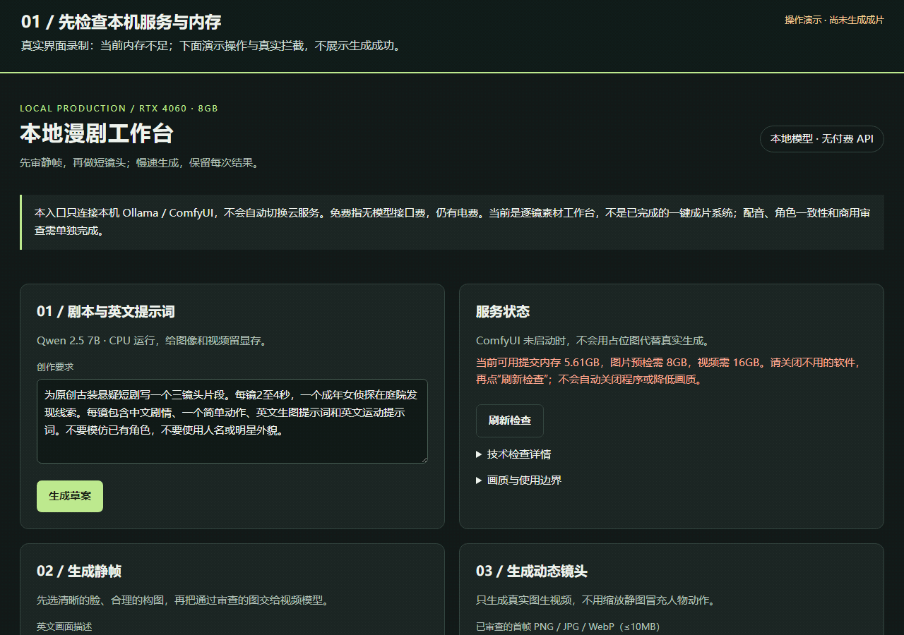

# AIvideo · 免费本地 AI 漫剧工作台

面向 **Windows + NVIDIA 显卡** 的本地 AI 漫剧实验工程：用 Ollama 写草案、ComfyUI 生成关键帧和短动态镜头，再由人审片、剪辑。支持可选的 Toonflow 2.x 媒体供应商接入。

**当前定位：可运行的本地生成网关与逐镜工作台，不是一键生成商用精品短剧的成品。**

[界面截图](docs/SCREENSHOTS.md) · [算法与模型](docs/ALGORITHMS_AND_MODELS.md) · [部署指南](docs/PUBLIC_DEPLOYMENT.md) · [Apache-2.0](LICENSE) · [第三方许可](docs/THIRD_PARTY_NOTICES.md)

## 操作动图

约 27 秒、515 KiB：填写提示词 → 设置画幅与种子 → 点击静帧提交 → 读取真实内存拦截 → 选择首帧文件并设置视频参数 → 查看任务区。



**这是操作教程，不是成功生成样片：** 录制时内存不足，静帧请求真实返回 HTTP 503，没有任务入队。首帧选择用已公开的工作台截图演示，未提交视频；没有伪造进度、素材或成功状态。顶部步骤条、黄色高亮和光标为录制注释，操作节奏经过剪辑，不代表模型生成速度。

逐步文字说明、录制来源和重录方法见[操作动图说明](docs/GENERATION_WALKTHROUGH.md)。

## 项目截图

下图来自实际运行的工作台，无合成任务或伪造生成结果。拍摄时队列为空、内存预检未通过，因此如实显示提示；这是界面展示，不是 GPU 成片或画质验收。


<details>
<summary>查看静帧/动态镜头入口与服务检查截图</summary>


</details>

截图来源、拍摄记录及重拍方法见[截图说明](docs/SCREENSHOTS.md)。

## 项目状态

- 已实现本地文本、文生图、单首帧图生视频入口、持久化队列、重启接管与素材下载。
- 网关只连接数字 loopback 地址，不继承 HTTP 代理、不跟随重定向、失败不回退收费 API。
- 图片和视频串行；队列有进程锁，未知提交结果暂停等待人工核对，不盲目重复生成。
- 文本强制 CPU；Windows 内存预检不足时明确拒绝任务，不擅自关闭应用或修改页面文件。
- 原开发机：i7-14650HX / 32GB RAM / RTX 4060 Laptop 8GB。
- **尚未完成干净新机的 GPU 端到端复现，以及与参考短剧样片的同等画质验收。**
- 完整 Toonflow 应用不包含在本仓库中；配音、口型和自动剪辑不属于新网关的已完成功能。

“免费”指不使用按次收费的模型 API，仍有硬件、电费、存储和人工制作成本。下载模型也需要网络和磁盘。慢速卸载能缓解显存不足，但不能保证模型的角色一致性、五官、走路、打斗和复杂运镜达到商业样片效果。

## 当前能力

| 环节 | 本地后端 | 实际输出 / 约束 |
| --- | --- | --- |
| 剧本与提示词草案 | Ollama `qwen2.5:7b` | CPU、4096上下文、最多2048输出token；生成后卸载，需要人工编辑 |
| 文生图 | RealVisXL V5 / ComfyUI | 40步；竖屏720×1280、横屏1280×720、方图1024×1024 |
| 图生视频 | Wan2.1 I2V 14B FP8 / ComfyUI | 20步、37层交换；原生480×832、8fps、17/25/33帧；单首帧、无音轨 |
| 制作记录 | 本地 JSON + 文件 | 种子、工作流、模型文件名、Comfy prompt ID、错误和最终素材 |
| Toonflow 接入 | 自定义媒体供应商 TS | 当前版 `generateImage / generateVideo` 协议；无需 API Key |

视频选项“2/3/4秒”是首末帧的采样跨度，按8fps编码后文件通常为2.125/3.125/4.125秒。480×832是近似竖屏，不是精确9:16，也不是原生1080p。放大或插帧不等于补回不存在的细节。

### 使用哪些算法与模型

| 组成 | 算法 / 技术 | 在本项目中的用途 |
| --- | --- | --- |
| Qwen2.5 7B | 自回归 Transformer 语言模型 | 草拟剧本和提示词，由人编辑审核 |
| RealVisXL V5 / SDXL | 潜空间扩散；DPM++ 2M SDE + Karras 调度 | 生成静帧，当前没有角色参考条件或独立 Refiner |
| Wan2.1 I2V 14B | Flow Matching / DiT、时空 VAE、UMT5 与首帧视觉条件 | 从一张首帧生成短动态镜头，当前没有骨骼或运动轨迹控制 |
| 低显存运行 | scaled FP8、CPU 卸载、37 层 block swap、串行队列 | 用更多主内存与等待减少显存驻留，不保证提高画质 |
| 任务可靠性 | JSON 原子落盘、进程锁、已知任务接管、FFmpeg 验证 | 防止盲目重复生成，检查文件完整性，不代替人工审片 |

本仓库**接入已有模型，没有训练或发布自有基础模型**。完整参数、原理、代码对应关系和官方来源见[算法与模型说明](docs/ALGORITHMS_AND_MODELS.md)；权重许可与待核验项见[第三方许可清单](docs/THIRD_PARTY_NOTICES.md)。

## 开始前需要准备什么

当前正式入口仅支持 Windows。建议 PowerShell 7、Python 3.12。网关依赖不包含 ComfyUI、PyTorch/CUDA 或模型权重；它们必须单独准备。

| 组件 | 要求 |
| --- | --- |
| Python | 网关验证环境为3.12.5；根目录使用独立 `.venv` |
| FFmpeg | `ffmpeg`、`ffprobe` 加入 PATH，用于验证视频尺寸、帧率、帧数与完整解码 |
| Ollama | 本机11434端口，已安装 `qwen2.5:7b` |
| ComfyUI | 已就绪的独立环境，本机8488端口，能运行本仓库工作流 |
| 模型 / 节点 | 见下表及[公开部署说明](docs/PUBLIC_DEPLOYMENT.md) |
| Node.js | 仅供应商协议测试需要；验证版本24.19.0，网关和简单工作台无需 Node |
| 内存 | 可用提交内存预检：文本≥6GiB、图片≥8GiB、视频≥16GiB；不是机器标称总内存 |

### ComfyUI 模型与节点

模型不随仓库分发，也不会由网关自动下载。

| 文件 / 组件 | ComfyUI 位置或用途 |
| --- | --- |
| `RealVisXL_V5.0_fp16.safetensors` | `models/checkpoints/`，或自行配置额外搜索路径 |
| `Wan2_1-I2V-14B-480p_fp8_e4m3fn_scaled_KJ.safetensors` | `models/diffusion_models/` |
| `umt5-xxl-enc-fp8_e4m3fn.safetensors` | `models/text_encoders/`，须被节点识别 |
| `open-clip-xlm-roberta-large-vit-huge-14_visual_fp16.safetensors` | `models/clip_vision/` |
| `wan_2.1_vae.safetensors` | `models/vae/` |
| ComfyUI-WanVideoWrapper | 模型加载、Cached T5、block swap、视频采样/编解码；需其 tokenizer 和依赖 |
| ComfyUI-VideoHelperSuite | `VHS_VideoCombine` 导出 H.264 MP4 |

**重要复现限制：** 开发机的 ComfyUI / WanVideoWrapper 存在低内存加载、T5 CPU 和 block swap 等本地修改，这些外部修改未在本仓库打包。仅下载上游节点不等于复现了开发环境。先核对[版本基线与未打包修改](docs/PUBLIC_DEPLOYMENT.md#复现限制与开发机基线)，不要把 `/health` 成功视作8GB显卡已经完成生成验收。

模型来源请使用发布方：[RealVisXL V5](https://huggingface.co/SG161222/RealVisXL_V5.0)、[Kijai Wan FP8](https://huggingface.co/Kijai/WanVideo_comfy_fp8_scaled)、[Wan2.1 官方项目](https://github.com/Wan-Video/Wan2.1)。使用前核验具体文件、版本和许可。

## 快速开始：已有就绪的 ComfyUI

### 1. 获取代码，安装网关依赖

```powershell
git clone https://github.com/qinfendeyuyu/AIvideo.git
cd AIvideo
py -3.12 -m venv .venv
.\.venv\Scripts\python.exe -m pip install -r requirements.txt
```

不必激活虚拟环境，后面的命令直接使用其解释器。`requirements.txt` 使用版本下限，不是完整锁文件。

### 2. 准备本地模型服务

如果 Ollama 尚未安装该模型，手动执行（会下载数GB权重）：

```powershell
ollama pull qwen2.5:7b
```

确认 Ollama 在 `http://127.0.0.1:11434` 响应。用自己的 ComfyUI Python 环境启动 ComfyUI，监听 `127.0.0.1:8488`；具体命令、节点要求见[部署说明](docs/PUBLIC_DEPLOYMENT.md)。所有服务与网关必须在同一台电脑。

### 3. 预检并启动工作台

```powershell
.\scripts\start_local_free.ps1 -CheckOnly
.\scripts\start_local_free.ps1 -Background
```

打开 **[http://127.0.0.1:18766/](http://127.0.0.1:18766/)**。

希望前台看日志时：

```powershell
.\scripts\start_local_free.ps1
```

前台窗口 Ctrl+C 结束网关；它不会同时终止 ComfyUI 已接受的任务。后台启动的进程号和日志位置记录在 `logs/local_free.process.json`。

> `-StartComfy` 仅保留给原开发机：它调用的历史脚本含 D/E 盘固定路径和旧首帧检查，不适用于新装机。公开部署默认**不使用此选项**。不要运行历史页面文件、提权或自动重启脚本来绕过预检。

### 4. 逐镜制作与验收

1. 写剧本草案，人工整理成一个镜头一个主要动作。
2. 生成静帧，检查原始分辨率下的眼睛、嘴、手部、服装和背景。
3. 只用通过审查的原创或已授权关键帧生成2–4秒短片。
4. 播放并检查首/中/尾帧：身份是否稳定、动作是否真实、有没有闪烁和穿模。
5. 单镜合格后才做下一镜；最后单独完成配音、剪辑与权利核验。

不合格素材保留为测试结果，不以“成功返回MP4”或“静图推拉”代替质量通过。

## 接入 Toonflow（可选）

本项目参考 Toonflow 的制作流程，但没有复制或打包其完整应用。供应商协议核对基线为官方提交 `72a895c26aab3f54c5a914517615362208fa6008`。

1. 单独安装和启动当前 Toonflow。
2. 在“设置 → 媒体模型 → 添加自定义供应商”导入 [localFreeV2.ts](integrations/toonflow/localFreeV2.ts)。
3. 无需 API Key；供应商固定连接本机18766端口，选择本地图片或 Wan 视频模型。
4. 旧 `localWanComfy.ts` 已因旧模板许可边界退出当前公开版本，也不兼容当前 Toonflow；本机留存与历史版本见[退役说明](docs/LEGACY_TOONFLOW.md)。
5. 语言模型可单独配置 Ollama：地址 `http://127.0.0.1:11434/v1`，协议 `openai-completions`，Key留空，模型 `qwen2.5:7b`，上下文4096、最大输出2048。

直接由 Toonflow 调用 Ollama 不受本项目文本入口强制CPU参数控制，建议先写完文本再生成媒体。完整 Toonflow 代理工具调用尚未做端到端验收。详细限制见 [Toonflow 本地接入](docs/TOONFLOW_FREE_LOCAL.md)。

官方 README 中约130元指示范作品的模型调用费，不是 Toonflow 软件每条视频的固定收费；更换为本地模型会改变画质与能力，不能据此承诺同等效果。[官方说明（固定版本）](https://github.com/HBAI-Ltd/Toonflow-app/blob/72a895c26aab3f54c5a914517615362208fa6008/README.md)

## API 与任务恢复

交互文档：`http://127.0.0.1:18766/docs`。

| 方法 | 路径 | 用途 |
| --- | --- | --- |
| GET | `/health` | 节点、模型、队列与内存状态 |
| POST | `/text` | 本机CPU文本生成 |
| POST | `/jobs/image` | 文生图入队，返回202与任务ID |
| POST | `/jobs/video` | 单首帧图生视频入队 |
| GET | `/jobs` | 任务列表 |
| GET | `/jobs/{id}` | 状态与错误 |
| GET | `/jobs/{id}/asset` | 下载已完成PNG/MP4 |

图片请求示例（会实际加入生成队列）：

```powershell
$body = @{
    prompt = 'Original adult detective in a courtyard, clear eyes, natural daylight'
    aspect_ratio = '9:16'
    seed = 146500401
} | ConvertTo-Json
Invoke-RestMethod -Method Post -Uri 'http://127.0.0.1:18766/jobs/image' -ContentType 'application/json' -Body $body
```

视频的 `image` 字段接受有界 PNG/JPEG/WebP base64/Data URL，不接受公网图片地址或本地任意文件路径。

任务位于 `runtime_cache/local_free_jobs/`，Comfy输出另保存在其输出目录。已知 prompt ID 会在网关重启后接管；提交确认丢失、状态文件损坏或 Comfy 任务消失会进入 `needs_attention` 并暂停后续队列。必须人工核对日志和产物，目前没有一键盲重试接口。

## 测试

不需要下载模型或占用GPU即可测试协议与状态机；视频结构检查及旧流水线测试仍需要 FFmpeg/FFprobe。

```powershell
.\.venv\Scripts\python.exe -m pytest -q
node --experimental-vm-modules .\tests\test_toonflow_provider_contract.mjs
```

2026-10-08验证：82项Python测试与供应商13组Node协议测试通过。覆盖外部地址拒绝、输入校验、内存门禁、单worker/进程锁、落盘失败、重启接管、未知提交结果、视频文件验证、取消等待，以及文档截图、动图完整性与许可文件检查。**协议测试不是GPU样片，更不是商用画质验收。**

若 Windows 的系统临时目录因权限导致 pytest 初始化失败，可换用一个尚不存在的项目内目录，例如 `--basetemp .pytest-temp-run-001`；不要指向真实素材或已有工作目录，pytest 会管理并清理该目录。本轮完整测试使用了独立项目内临时目录。

## 目录

```text
app/                  当前工作台页面 + 历史实验流水线
scripts/              本地网关、启动器及明确标注的实验工具
integrations/toonflow/ Toonflow媒体供应商
workflows/            ComfyUI API格式工作流
configs/              示例配置；个人models.yaml不提交
tests/                无模型协议/状态测试和诊断合成测试
docs/                 部署、算法、截图、第三方许可与历史权利记录
docs/screenshots/     实际页面截图及拍摄记录
docs/licenses/        固定版本的第三方许可文本
assets/fonts/         Noto Sans SC及OFL许可
LICENSE / NOTICE      Apache-2.0正文与归属声明
runtime_cache/        运行时任务与素材（Git忽略）
```

`app/main.py` 是旧实验流水线的API入口，不是新免费网关；`configs/models.example.yaml` 中保留其示例设置。旧 SadTalker/SAPI/Kokoro 路线不因代码发布而自动获得商用清权，也不受新网关的仅本机限制约束。

## 常见问题

**服务都启动了，为什么 ready=false？**

看 `memory`、`comfy.*_missing` 和 `ollama.model_available`。总内存32GB不代表可用提交内存足够；先保存工作并关闭不用的软件，再刷新。程序不会自动关应用或修改页面文件。

**跑得很慢，能否无限放慢保证精品？**

不能。速度可以让模型卸载到CPU/内存运行，但不会无限提高模型能力。先做一个短镜头的视觉验收，失败要调整素材、镜头设计或模型路线。

**为什么取消了 Toonflow，显卡还在计算？**

取消仅停止本次等待，不会对共享 ComfyUI 发送全局 interrupt。先查任务列表，再决定是否重新提交。

**模型下载后还是缺节点/内存溢出？**

检查节点版本、tokenizer、模型文件名、PyTorch环境和本机补丁差异。不要关闭门禁、冒充高分辨率或用占位素材掩盖失败。

## 安全、权利与发布范围

- 只绑定本机，不提供公网认证方案；不要把网关或 ComfyUI 直接暴露到公网。
- 不上传模型、生成视频、首帧、日志、缓存、私人配置、SSH运维脚本或凭据。
- 模型、节点、字体、声音和输入素材各有许可；“本地免费”不等于最终视频已获得所有商业权利。
- [历史商用权利台账](docs/COMMERCIAL_RIGHTS_LEDGER.md)是指定版本的工程记录，不是对所有输出的保证。
- Noto Sans SC随附 [OFL 1.1](assets/fonts/NotoSansSC/OFL.txt) 和来源说明；第三方模型及完整上游软件不随仓库分发。

## 开源协议

本项目自有代码与文档采用 **[Apache License 2.0](LICENSE)**，版权及归属声明见 [NOTICE](NOTICE)。它允许在遵守许可条件的前提下使用、修改和分发，并包含贡献者可授权范围内的专利授权；不是对所有专利、商标或输出素材的权利保证。[Apache 官方原文](https://www.apache.org/licenses/LICENSE-2.0)

授权范围需分开看：

- **项目自有代码 / 文档**：Apache-2.0；再分发时遵守许可文本、修改声明及相关归属保留要求。
- **第三方协议定义 / 字体 / 软件**：保留各自原许可；新版 Toonflow 参考源为 MIT，随附字体为 OFL 1.1，ComfyUI / VideoHelperSuite 则有 GPL 条款，不能全部改标 Apache。
- **模型权重 / 输入素材 / 生成内容**：不因根许可证而被重新授权。RealVisXL 的 OpenRAIL 使用限制、部分转换组件待补的来源证据、配音和肖像授权等，仍需单独核验。
- **旧 Toonflow 1.x 历史文件**：当前版本不再分发该旧适配器，Git 历史未改写；根许可证不追溯改变其原附加条款。

具体版本、官方来源和未完成事项见[第三方许可与模型权利清单](docs/THIRD_PARTY_NOTICES.md)。此清单是工程核验记录，不是“所有生成视频均可无条件商用”的承诺。
