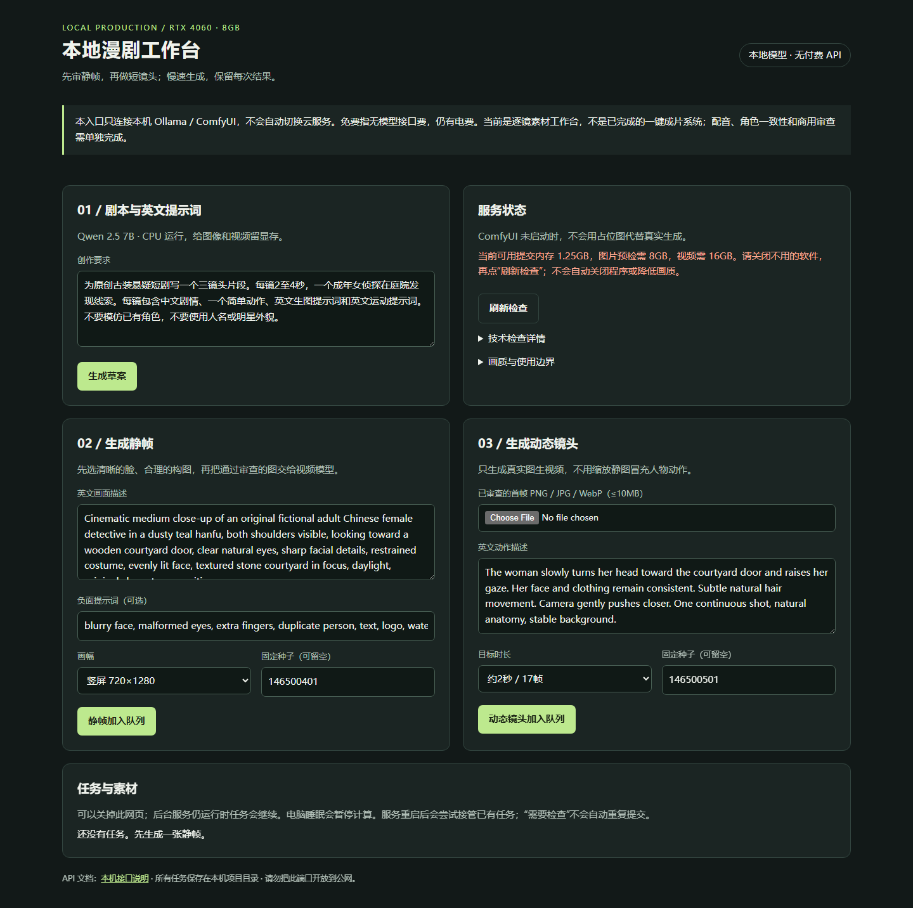
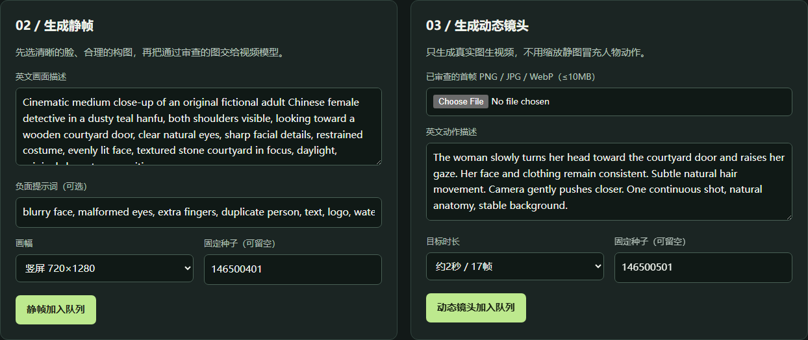
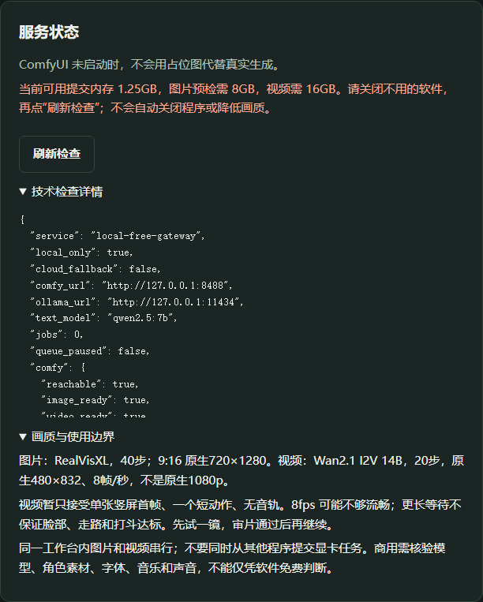

# 项目截图与拍摄说明

以下是 2026-10-08 从实际运行的本地工作台拍摄的界面截图，不是设计稿、合成效果图或模型输出样片。页面没有替换 API 返回值，没有虚构任务或生成结果；全部为只读查看，没有提交 GPU 生成任务。

拍摄时 Ollama / ComfyUI 可连通、模型节点检查通过，但可用提交内存低于图片 8 GiB / 视频 16 GiB 门槛（数值见截图及拍摄记录），故页面如实显示未就绪。这个状态是拍摄当时的资源情况，不是该硬件永久不能生成。截图不证明已通过新机 GPU 复现或参考样片画质验收。

## 工作台总览

包含文本草案、服务状态、静帧、短镜头以及任务列表。拍摄时任务列表为空，未公开任何私人素材。



## 静帧与动态镜头入口

左侧先生成并审查静帧，右侧上传单张首帧、描述一个短动作，再加入本机队列。画面中的英文提示词是页面自带的可编辑示例，不是已生成内容。



## 服务预检与画质边界

展开页面自带的“技术检查详情”和“画质与使用边界”。详情为可滚动区域，截图保留其原始页面布局；完整内存读数及截图哈希见 [拍摄记录](screenshots/capture-manifest.json)。



## 如何重新拍摄

脚本：[capture_project_screenshots.cjs](../scripts/capture_project_screenshots.cjs)。需要 Node.js、另行准备的 Playwright 和对应 Chromium；它们仅用于文档截图，不属于运行工作台的必需依赖。不要为截图重新安装模型。

1. 启动本机网关，确认 `http://127.0.0.1:18766/` 是目标工作台。
2. 使用没有任务记录的独立测试环境；脚本遇到任何现有任务会拒绝拍摄，**不要为了截图删除真实制作记录**。
3. 让 Node 能解析已安装的 `playwright`（如通过临时 `NODE_PATH` 指向其 `node_modules` 目录），然后在仓库根目录运行：

```powershell
node .\scripts\capture_project_screenshots.cjs
```

脚本只允许浏览器向本机网关发送页面、预检和任务查询 GET 请求，阻止生成 POST 和外部资源，不使用浏览器登录资料。它拍摄三个 PNG 并更新记录；会覆盖对应文档截图，不改动业务队列。发布前必须人工检查图片及记录，避免分享私人信息。依赖版本、页面变化或机器资源变化会改变截图，不要求像素级一致。
